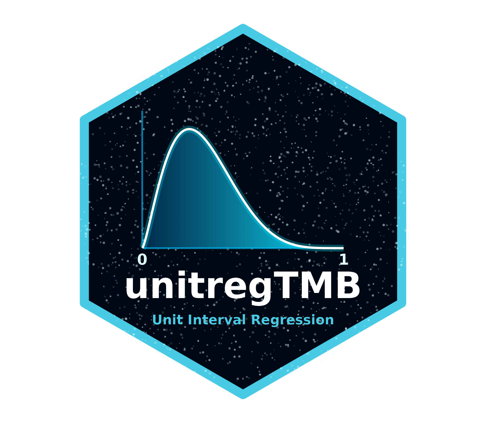

# unitregTMB: An R Package for Zero- and One-Inflated Mixed-Effects Models on the Unit Interval 

<!-- badges: start -->
[](https://github.com/rpetterle/unitregTMB/actions/workflows/R-CMD-check.yaml)
<!-- badges: end -->

**unitregTMB** provides a flexible framework for regression modeling of continuous bounded responses (e.g., rates, proportions, and indexes) on the four unit intervals, $(0,1)$, $[0,1)$, $(0,1]$, and $[0,1]$. It supports mean, quantile, and modal regression, as well as fixed- and mixed-effects models for clustered, longitudinal, and repeated-measures data. Built on **Template Model Builder (TMB)** in C++, it combines automatic differentiation and the Laplace approximation to efficiently estimate fixed and random effects.

## Key Features

* **Wide Range of Distributions:** Supports multiple parameterizations for bounded data:
  * **Mean regression:** Beta, Simplex, Vasicek, Unit-Gamma, Bessel.
  * **Quantile regression:** Kumaraswamy, Vasicek, Unit-Weibull, Unit-Gompertz, Johnson's SB, arc-secant hyperbolic Weibull (ASHW), Unit-Birnbaum-Saunders.
  * **Mode regression:** Beta, Kumaraswamy, Unit-Gamma, Unit-Gompertz.
* **Mixed-Effects:** Easily incorporate random intercepts and slopes to account for clustered, longitudinal, or repeated-measures data using standard `(1 | id)` syntax.
* **Zero- and One-Inflation:** Natively handles data with point masses at the boundaries (exact 0s and/or 1s) through threshold equations.
* **Model Selection & Diagnostics:** Includes built-in methods for variable selection (`stepCriterion`), model comparison for non-nested models (`vuong_test`, `pairwise_vuong_test`), and extracting mathematical formulas (`extract_equations`).

## Installation

You can install the development version of `unitregTMB` from GitHub using the `remotes` package. 

**Important:** `unitregTMB` depends on the `unitcore` package, which must be installed first. Please also note that a C++ compiler is required (e.g., Rtools for Windows, Xcode for macOS).

```r
# install.packages("remotes")

# 1. Install the unitcore dependency
remotes::install_github("rpetterle/unitcore")

# 2. Install unitregTMB
remotes::install_github("rpetterle/unitregTMB")
```

## Quick Start Example

Here is a quick example demonstrating how to fit a mixed-effects Vasicek model using the built-in `bodyfat_long` dataset.

```r
library(unitregTMB)

# Load the longitudinal body fat percentage dataset
data("bodyfat_long", package = "unitregTMB")

# Fit a Vasicek mean regression model with a random intercept for subject ID
fit <- unitregTMB(
  formula = y ~ age + bmi + gender + regions + (1 | id),
  phi.formula = ~ 1,
  data = bodyfat_long,
  family = vasicek(model_for = "mean")
)

# View model summary
summary(fit)

# Extract the LaTeX equations of the fitted model
extract_equations(fit)
```

## Model Comparison (Vuong Test)

`unitregTMB` allows you to rigorously compare non-nested competing models (e.g., Vasicek vs. Beta distributions) using pointwise log-likelihoods exported directly from the C++ template:

```r
fit_beta <- unitregTMB(
  formula = y ~ age + bmi + gender + regions + (1 | id),
  data = bodyfat_long,
  family = beta_fam(model_for = "mean")
)

# Perform a Vuong Likelihood Ratio Test
vuong_test(fit, fit_beta)
```

## License

This package is licensed under the MIT License.